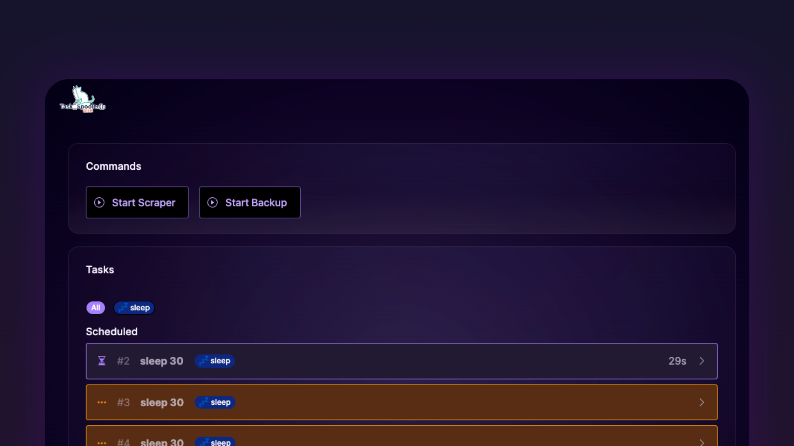

# tsp-web

Displays a overview of the task spooler server of your machine in real time.



## Installation

1. Make sure [you have `task-spooler` installed on your system](https://github.com/justanhduc/task-spooler)

1. Download the tsp-web binary from our [releases page](https://github.com/BrunnerLivio/tsp-web/releases)
2. Make it executable

```bash
chmod +x ./tsp-web*
```

3. Run it

```bash
./tsp-web*
```

4. Run your first task

```bash
ts -L sleep sleep 30
```

### Arguments and Environment variables

| Argument      | Environment         | Description                                         | Example                                 | Default     |
|:--------------|:--------------------|:----------------------------------------------------|:----------------------------------------|:------------|
| `--ts-bin`    | `TSP_WEB_TS_BIN`    | The binary name of TSP                              | `tsp` (for Linux) <br /> `ts` (for Mac) | `tsp`       |
| `--port`      | `TSP_WEB_POST`      | The port number to run TSP-Web on                   | `8080`                                  | `3000`      |
| `--host`      | `TSP_WEB_HOSTNAME`  | The hostname to run TSP-Web on                      | `192.168.0.20`                          | `localhost` |
| `--log-level` | `TSP_WEB_LOG_LEVEL` | The log level can be `'debug' or 'info' or 'warn'`  | `warn`                                  | `info`      |
| `--no-color`  | -                   | Whether the logs should be displayed without colors | -                                       | `false`     |

### Configuration

The configuration of `tsp-web` can be found in the folder `$XDG_CONFIG_HOME/tsp-web/config.yml`.

```yaml
commands:
  - name: "Sleep"
    args: ["-L", "sleep", "sleep", "30"]

labels:
  - name: sleep
    bgColor: '#0C2880'
    fgColor: 'black'
    icon: 💤
```
